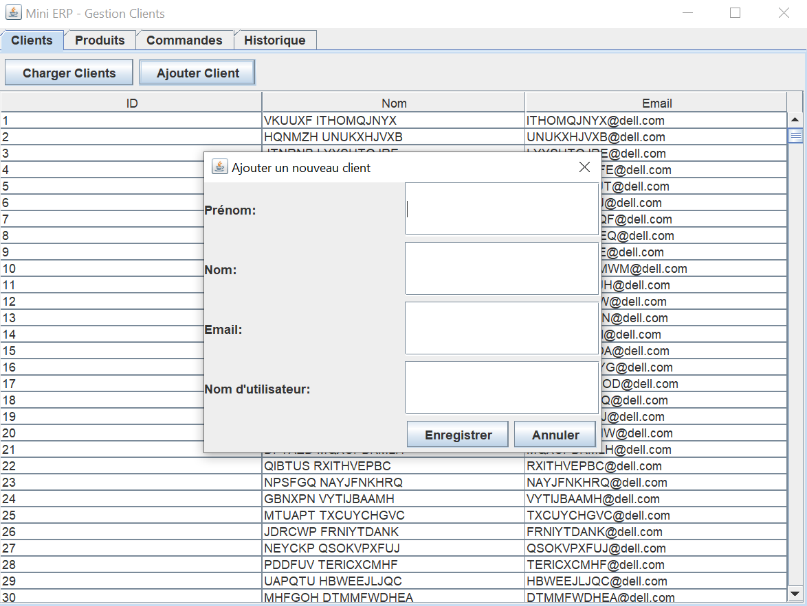
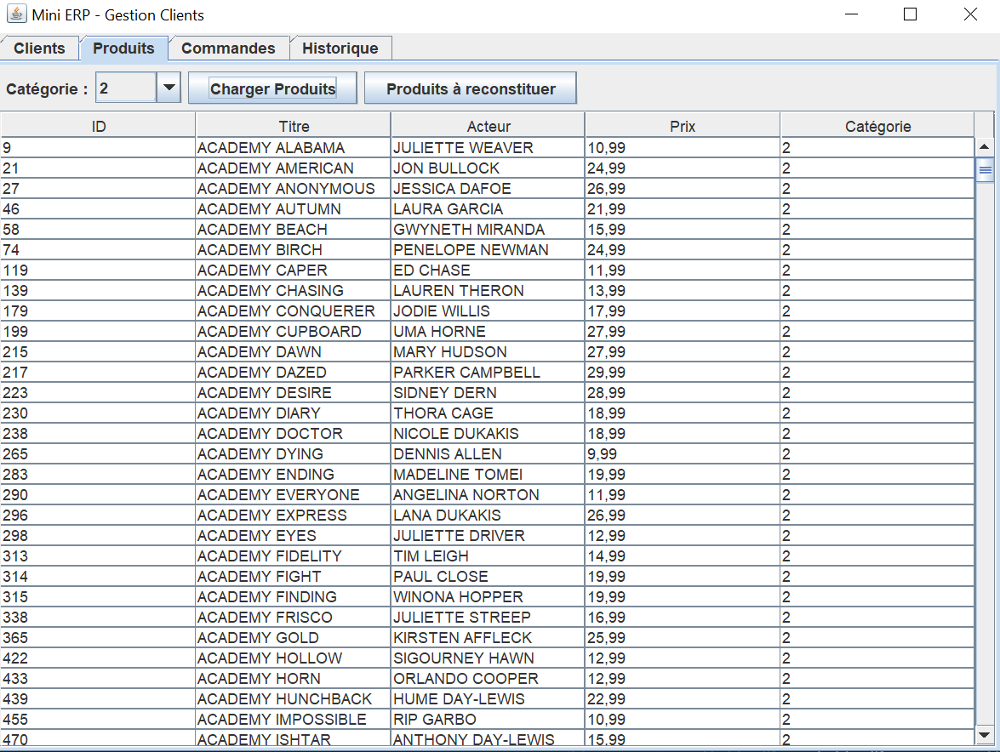
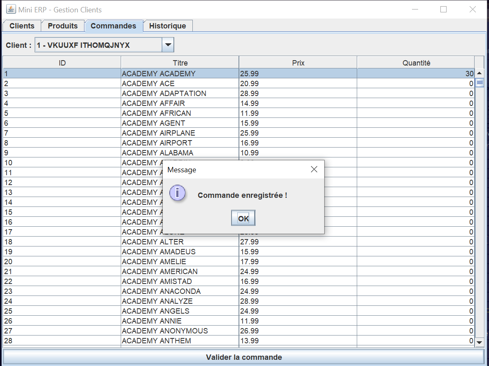
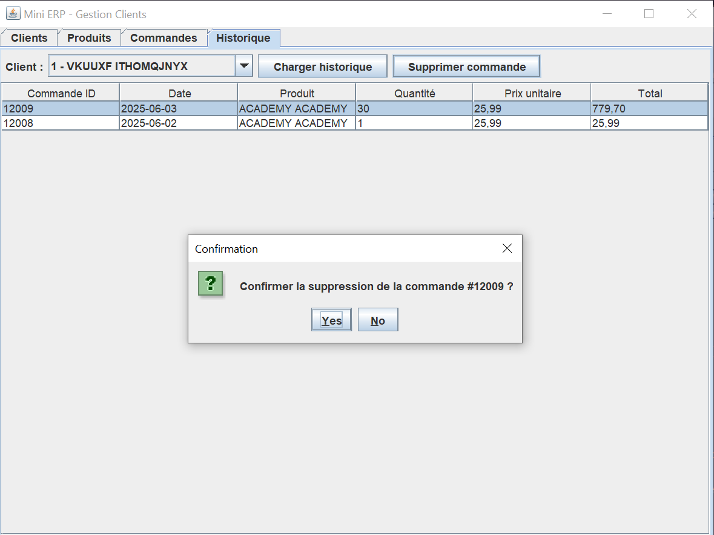

# 📦 Mini ERP – Gestion de Clients, Produits et Commandes

Ce mini ERP Java permet de gérer une base de clients, de produits, de commandes et de stock à travers une interface graphique simple réalisée en Swing.

---

## ⚙️ Configuration JDBC

Le projet utilise PostgreSQL via JDBC.

### 📌 Informations à adapter dans `DatabaseManager.java` :

```java
private static final String URL = "jdbc:postgresql://localhost:5432/ERP";
private static final String USER = "postgres";
private static final String PASSWORD = "root";
```
---

## 🖥️ Capture d’écran de l’interface

📸 
📸 
📸 
📸 
📸 
📸 

---

## 🚀 Consignes de lancement

1. Cloner le dépôt :
```bash
git clone https://github.com/ton-utilisateur/mini-erp-java.git
```

2. Ouvrir le projet dans son IDE

3. Vérifier les paramètres JDBC dans `DatabaseManager.java`

4. Lancer `MainFrame.java` (classe principale de l’interface)

---

## 📁 Structure principale

```
src/
├── com.minierp.ui       # Interfaces graphiques (Swing)
├── com.minierp.dao      # Accès base de données
├── com.minierp.model    # Modèles (Client, Product, etc.)
├── com.minierp.db       # Connexion JDBC
```

---

## 📌 Dépendances

- Java 8+  
- PostgreSQL  
- JDBC Driver PostgreSQL (`org.postgresql.Driver`)

---

## ✨ Auteur·rice

Projet réalisé dans le cadre de la formation CDA – Simplon.co  
Imane Barbeche – 2025
# MiniERP
